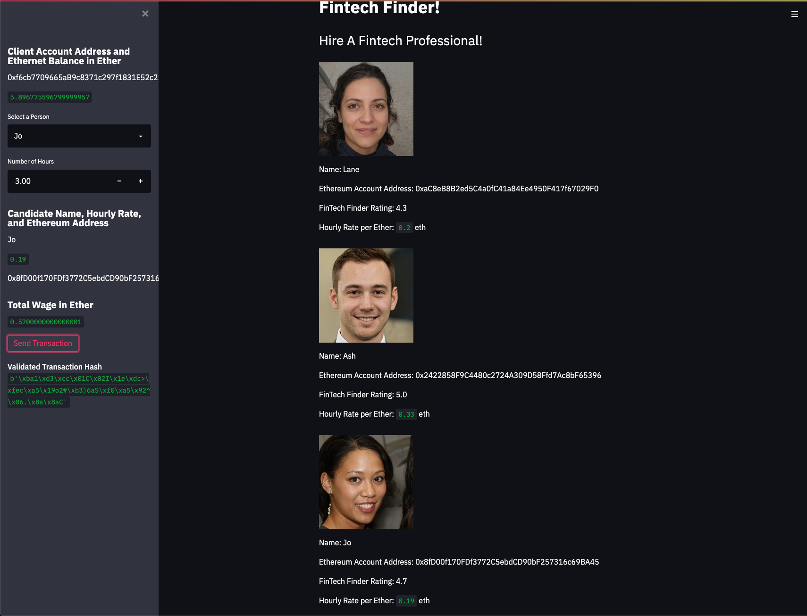
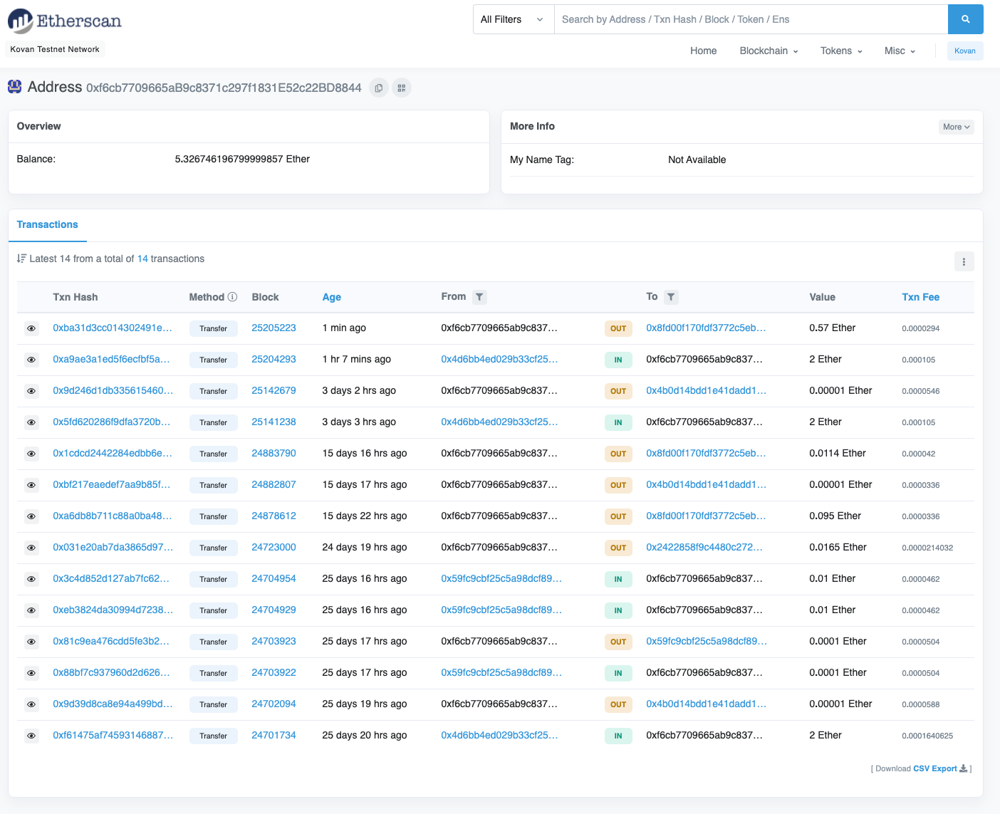
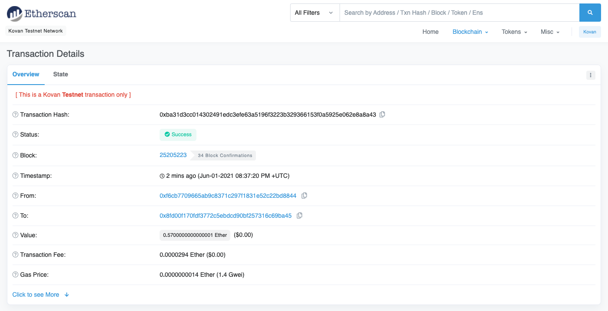
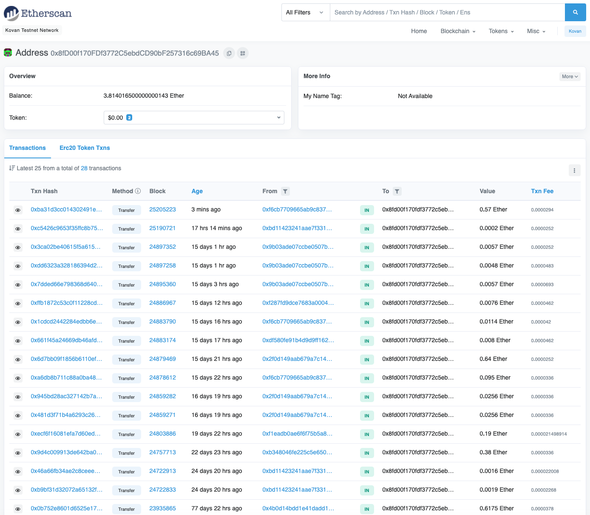

# Module 19 Challenge

This is the repository for my module 19 challenge. In this module challenge, we integrated the Ethereum blockchain network into an application in order to enable customers to send cryptocurrency payments to fintech professionals. 

This application consists of two files: fintech_finder.py and crypto_wallet.py. We import Ethereum transaction functions from the crypto_wallet.py into our fintech_finder.py, which is the main program interface file for our Fintech Finder application.


A customer is able to do the following by using the Fintech Finder application:

(1) Generate a new Ethereum account instance by using their mnemonic seed phrase.

(2) Fetch and display the account balance associated with their Ethereum account address.

(3) Calculate the total value of an Ethereum transaction, including the gas estimate, that pays a Fintech Finder candidate for their work.

(4) Digitally sign a transaction that pays a Fintech Finder candidate, and send this transaction to the Kovan testnet.

(5) Review the transaction hash code associated with the validated blockchain transaction.

---

## Technologies

Import the following at the beginning of crypto_wallet.py file:

```python
import os
import requests
from dotenv import load_dotenv
load_dotenv()
from bip44 import Wallet
from web3 import Account
from web3.auto.infura.kovan import w3
from web3 import middleware
from web3.gas_strategies.time_based import medium_gas_price_strategy
```

Import the following at the beginning of fintech_finder.py file:

```python
import streamlit as st
from dataclasses import dataclass
from typing import Any, List
from crypto_wallet import generate_account, get_balance, send_transaction
```

---

## Examples

#### This first image shows the layout of the streamlit application.




#### Customer's address balance and history on Etherscan.




#### Transaction details on Etherscan.




#### Recipient’s (fintech professional) address balance and history on Etherscan.




---

## Contributors

UCB Fintech Bootcamp, Wynham Guillemot 

---

## License

MIT License

Copyright (c) [2021] [UCB Fintech Bootcamp, Wyham Guillemot]

Permission is hereby granted, free of charge, to any person obtaining a copy
of this software and associated documentation files (the "Software"), to deal
in the Software without restriction, including without limitation the rights
to use, copy, modify, merge, publish, distribute, sublicense, and/or sell
copies of the Software, and to permit persons to whom the Software is
furnished to do so, subject to the following conditions:

The above copyright notice and this permission notice shall be included in all
copies or substantial portions of the Software.

THE SOFTWARE IS PROVIDED "AS IS", WITHOUT WARRANTY OF ANY KIND, EXPRESS OR
IMPLIED, INCLUDING BUT NOT LIMITED TO THE WARRANTIES OF MERCHANTABILITY,
FITNESS FOR A PARTICULAR PURPOSE AND NONINFRINGEMENT. IN NO EVENT SHALL THE
AUTHORS OR COPYRIGHT HOLDERS BE LIABLE FOR ANY CLAIM, DAMAGES OR OTHER
LIABILITY, WHETHER IN AN ACTION OF CONTRACT, TORT OR OTHERWISE, ARISING FROM,
OUT OF OR IN CONNECTION WITH THE SOFTWARE OR THE USE OR OTHER DEALINGS IN THE
SOFTWARE.
